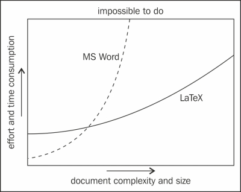

+++
title = 'MacTeX'
date = 2024-02-22T19:01:58+01:00
draft = false
+++

## MacTeX et compagnie…

A la lecture de l'article de la [Boîte à Grimoire](https://grimbox.be/technologeek/code/asciidoctor-vs-markdown-vs-latex/#the-top), je me dis qu'il serait bon d'aller plus loin concernant la discussion sur LaTeX.
Il me semble questionnable de comparer Asciidoctor, LaTeX et Markdown.
Pour moi, ces trois environnements de production écrite ne visent pas le même plublique ni les mêmes utilisateurs.
L’utilisation de Markdown se prête-t-elle à l’écriture d’articles ou de mémoires scientifiques ?
Pas sûr.
A l’inverse, est-il opportun d’utiliser LaTeX pour présenter une idée à ses collègues ou faire un résumé du dernier roman qui nous a plu ?
Pas sûr non plus.

Par contre, Grim et moi nous rejoignons sans doute sur le fait que Word est parfaitement dispensable !



Revenons donc à LaTeX et plus précisément LaTeX sur mac : MacTek.
LaTeX/MacTex a bien les défauts cités par mon compagnon compère mais… quel langage ou environnement n'en a pas ?
Et, ces défauts sont-ils si graves que cela ?

La syntaxe est certes ardue mais si on l'utilise régulièrement nul besoin de passer sa vie sur StackOverflow pour créer un document.
Argument valable pour n'importe quel langage.
Les commandes de LaTeX sont ardues mais c'est le pendant d'une qualité : avec LaTeX il est possible des faires des choses bien plus poussées et de manière bien plus fines que dans n'importe quel autre environnement.

LaTeX/MacTex prend énormément de place.
Oui mais, en contrepartie, il fonctionne directement et n'as (presque) pas besoin de paquets supplémentaires (heureusement !).
Sur un Mac M1, la dernière version de MacTek prend 11,3Go.
Ca fait beaucoup là, nan ? (copyright Mister V)

## Désinstaller des paquets
Oui, ça fait beaucoup.
Mais MacTek vient avec un outil graphique ***Tex Live Utility*** (***TLU***) qui permet de gérer les packages installés.
Il est donc possible d'installer, de mettre à jour ou de *désinstaller* les paquets de son choix.
Et si vous avez une aversion pour les interfaces graphiques ou si *TLU* ne vous satisfait pas, vous pouvez toujours passer par des lignes de commande.

Pour la désinstallation de paquets, il suffit de taper la commande :
```
    tlmgr remove <pkg>
```
Et s'il vous résiste, vous pouvez forcer la suppression en ajoutant le paramètre *--force* :
```
    tlmgr remove --force <pkg>
```

## Les schémas
Pour LaTeX il y a trois type de packages : les *packages*, les *collections* et les *schémas*.
Un schéma est un ensemble global de collections de packages.
Une collection se compose d'un ou plusieurs packages.
Et un package, le regroupement de niveau le plus bas dans TeX Live, contient les fichiers de macros TeX, les fichiers de polices, et ainsi de suite.

Il y a quelques schéma remarquable : *scheme-full*, *scheme-tetex*, *scheme-medium*, …


### Scheme-full
Le schéma complet installe tout (ou presque) ce qui est disponible.
Si MacTek prend autant de place c'est justement parce qu'il vient avec tout ou presque.
Cela se traduit principalement par l'installation par défaut du package *scheme-full* qui, comme son nom l'indique, installe… bah… tout.
Mais le mauvais *tout* ; le *tout* de "*tout et n'importe quoi*".

Cette désinstallation peut se faire soit via l'outil *TLU* soit via la commande (avec sudo si nécessaire):
```
    tlmgr remove scheme-full
```
Ici je l'ai fait en utilisant *TLU* et après plusieurs looooooooongues minutes de traitement, cela a supprimé environ la moitier des packages installés et la taille de MacTek descend à 8,9Go soit ~2,5Go de gagné.

### Scheme-tetex & Scheme-medium
En dessous de *scheme-full* en terme de complétude, il y a le package *scheme-tetex*.
Lui aussi vient avec un tout un tas de package dont nous (je) n'avons pas besoin pour la plupart.

Tout comme précédemment, la désinstallation peut se faire soit via l'outil *TLU* soit via la commande (avec sudo si nécessaire) :
```
    tlmgr remove scheme-tetex
```
La commande supprime jusqu'à 557 packages même si la place gagnée est moindre.
Vous pouvez également désinstaller *scheme-medium*… Attention que plus vous désinstallez, plus vous risquez de devoir réinstaller ;-)

## Et ensuite ?
La désinstallation de packages peut créer des backups : il compresse les packages et les garde en local, je suppose pour une réinstallation facile, rapide et qui ne requiert pas de connexion à internet.
Il est donc possible de supprimer ces backups si vous êtes certains que de pas avoir besoin de ces packages ou si vous avez une connexion internet de manière suffisamment  régulière.

Dans mon cas, la suppression de ces backups me fera gagner 4,5Go.
Et comme j'ai une accès rapide à internet que ce soit au travail ou à la maison, le choix est vite fait : je supprime les backups !
Pour ce faire, là aussi, ligne de commande :
```
    cd /usr/local/texlive/2023/tlpkg/backups
    sudo rm -rf *
```

Une fois cette suppression faite, MacTeX ne prend plus "que" 3,5Go !
Il est possible de continuer et de supprimer la documentation de latex composé d'un ensemble de fichier HTML, PDF et MD.
Le raisonnement est le même que précédemment : si vous avez un accès à internet très régulièrement ou si vous êtes un dieu en LaTeX, vous pouvez sans doute vous passer de la documentation 95/99% du temps et donc faire le choix de supprimer les 1,5Go de documentations qui viennent avec MacTeX.

Pour ce faire, encore et toujours, ligne de commange :
```
    cd cd /usr/local/texlive/2023/texmf-dist/doc
    sudo rm -rf *
```

Évidemment, avant de se frotter les mains et de passer à autre chose, il est important, si vous aviez déjà des documents LaTeX, de tester que ceux-ci compilent toujours !
Personnellement, après ce gros nettoyage, pour pouvoir compiler mes documents sans erreurs, j'ai dû réinstaller les packages suivants :

 - gensymb
 - tcolorbox
 - cancel
 - multirow
 - textpos
 - anyfontsize
 - shadowtext
 - titling
 - pdfcol

Il est ainsi possible d'atteindre la taille entre 1,95 et 2,1Go pour MacTeK.
Nous sommes loin des 11,3Go du début.
Mieux même : Microsoft Word, sur mon Mac prend 2,36Go ! Mon installation de MacTek est donc plus petite que l'outil de traitement de texte le plus répandu au monde ;-)

Prendre quelques minutes pour supprimer des centaines de paquets et en réinstaller 9 pour diviser la place prise par un facteur 5, ca vaut ***laaaaaargement*** le coup.